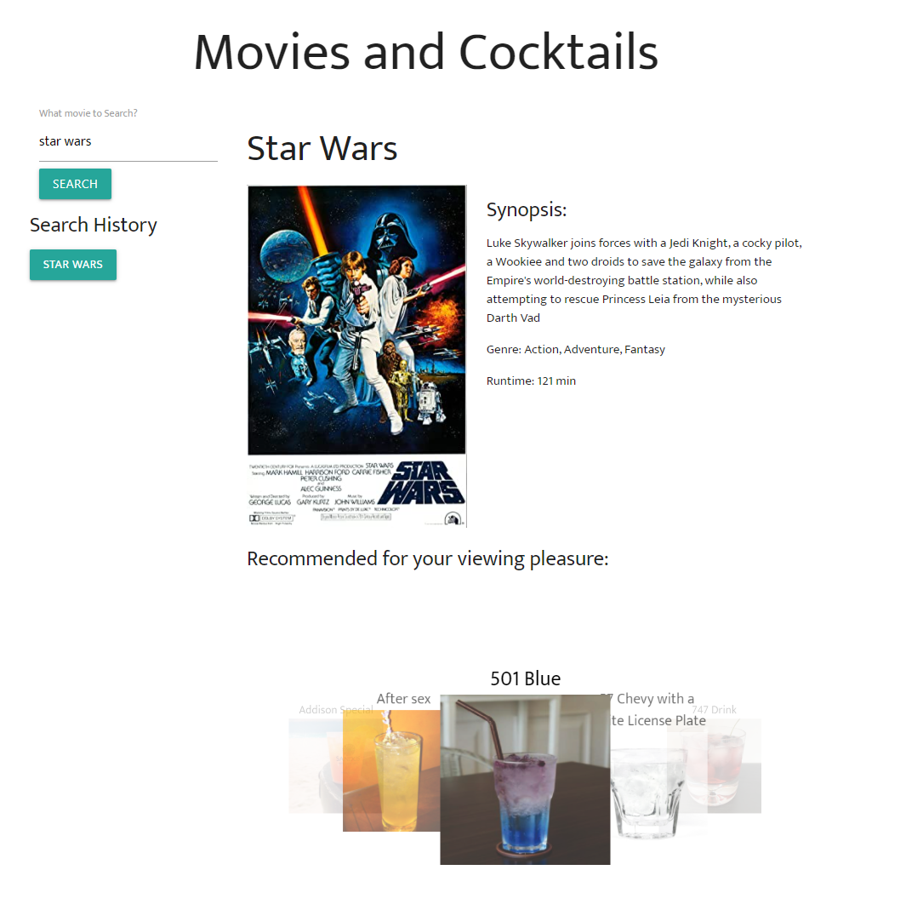
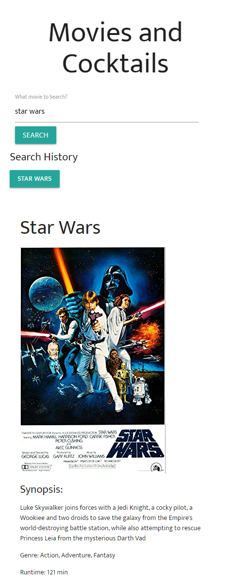
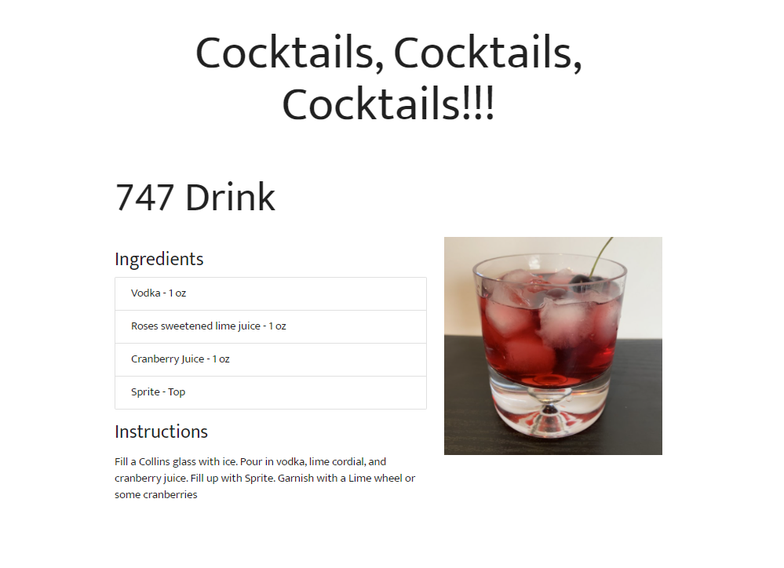
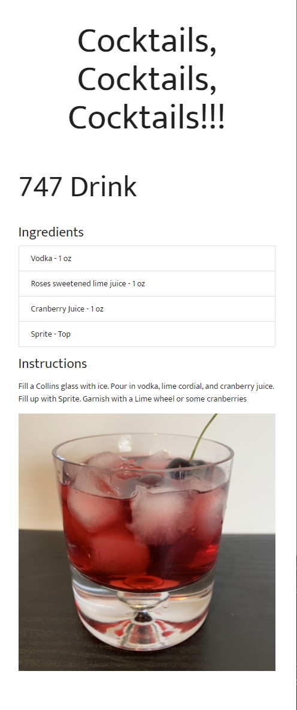
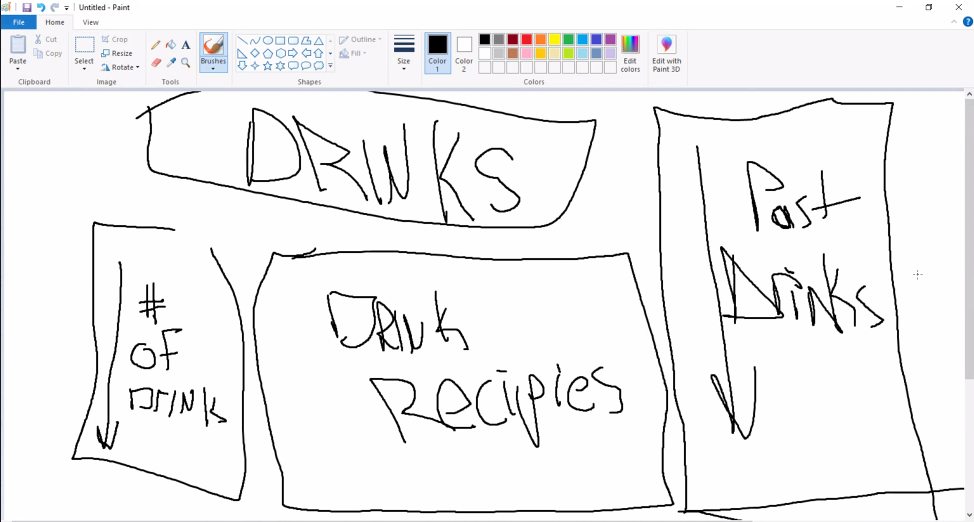

# Movies and Cocktails

This application allows users to search movies for a synopsis including a description, genre, and runtime. Based on the movie genre recommended cocktails are presented in a carousel. Clicking a drink from the carousel will take the user to ingredients and instructions on how to mix the chosen cocktail.

This application leverages Materialize CSS, SCSS, jQuery, jQueryUI

## Screenshots

### Desktop index.html

A simple desktop interface is presented with Materialize CSS



### Mobile index.html

A simple mobile interface is presented with Materialize CSS.



### Desktop drinks.html

This user interface uses screen real estate to display the selected cocktail ingredients and instructions on mixing



### Mobile drinks.html

This user interface is responsive and displays nicely for mobile users.



## Creating a branch

### Step 1

#### First step of the day

```
> git checkout main
> git pull
```

### Step 2

#### Create branch

```
> git checkout -b <your initials>/<your branch name>
```

### Step 3

#### Add & commit your code to your branch

```
> git add .
> git commit -m "message about your changes"
```

### Step 4

#### Make sure you have no conflicts with main

```
> git checkout main
> git pull
> git checkout <your initials>/<your branch name>
> git merge main
```

### Step 5

### Push changes to github

```
> git push
```

_if encountered conflicts with merge - after successful resolution, do another git commit "Step 3"_

### Go to github repo to create pull request to merge your changes into our main branch

## Wire frames

### Drinks page



## Github Deployed Application

https://samuelsholib.github.io/project-one/
